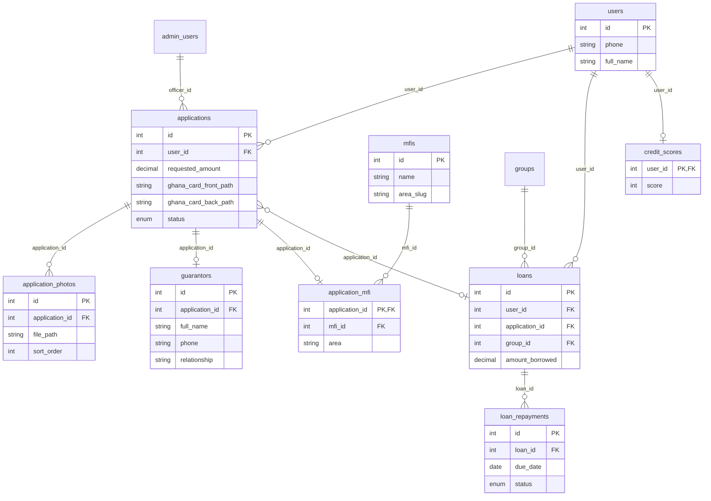

# TrustLoan – Deliverable References

Single reference for: database schema, dataset export, scoring logic, application controller, and screenshots to capture.

---

## 1. Database schema

**File:** `settings/trustloan.sql`

Full MySQL/MariaDB schema: one file (CREATE DATABASE, all tables, seeds, backfill). Run:  
`mysql -u root -p < settings/trustloan.sql` or execute in phpMyAdmin.

### Key tables and relationships

| Table | Purpose | Key relationships |
|-------|---------|-------------------|
| **users** | Borrowers (phone, full_name, password_hash, role) | — |
| **verification_codes** | OTP/verification codes | phone → users.phone (logical) |
| **applications** | One per user flow: amount, business, Ghana Card paths, status | user_id → users.id |
| **application_photos** | 2–3 photo paths per application | application_id → applications.id |
| **guarantors** | One per application (name, phone, relationship, occupation) | application_id → applications.id |
| **mfis** | Microfinance institutions (name, area_slug) | — |
| **application_mfi** | User’s MFI choice per application | application_id → applications.id, mfi_id → mfis.id |
| **groups** | Post-approval groups | mfi_id → mfis.id |
| **group_members** | Users in groups (member/head) | group_id → groups.id, user_id → users.id |
| **meeting_locations** | Per group (name, day, time) | group_id → groups.id |
| **loans** | Disbursed loan per application | user_id, application_id, group_id |
| **loan_repayments** | Instalments per loan | loan_id → loans.id |
| **credit_scores** | One score (0–100) per user | user_id → users.id |
| **admin_users** | Admin/officer accounts | applications.officer_id → admin_users.id |
| **audit_logs** | Admin action log | admin_user_id → admin_users.id |
| **settings_*** | Loan products, repayment, penalties, risk, notifications | — |

**Application-centric flow:**  
`users` → `applications` (1:many) → `application_photos`, `guarantors`, `application_mfi` (1:1 or 1:many). After approval: `loans` → `loan_repayments`; `credit_scores` is per `user_id`.

### Schema diagram (key tables)



---

## 2. Dataset export mapping

**Full field list and notes:** `docs/DATASET-FIELDS.md`

**One row per application (SQL):**

```sql
SELECT
  a.id AS application_id,
  a.user_id,
  u.phone AS borrower_phone,
  u.full_name AS borrower_name,
  a.requested_amount,
  a.repayment_weeks,
  a.business_type,
  a.business_duration,
  a.business_location,
  a.ghana_card_front_path,
  a.ghana_card_back_path,
  a.status,
  a.submitted_at,
  a.notes AS rejection_reason,
  g.full_name AS guarantor_name,
  g.phone AS guarantor_phone,
  g.relationship AS guarantor_relationship,
  g.occupation AS guarantor_occupation,
  m.name AS mfi_name,
  am.area AS mfi_area
FROM applications a
JOIN users u ON u.id = a.user_id
LEFT JOIN guarantors g ON g.application_id = a.id
LEFT JOIN application_mfi am ON am.application_id = a.id
LEFT JOIN mfis m ON m.id = am.mfi_id
ORDER BY a.submitted_at DESC;
```

**Photos:** `SELECT application_id, file_path, sort_order FROM application_photos ORDER BY application_id, sort_order;` — resolve `file_path` relative to project root (e.g. `uploads/applications/1/photo_0.jpg`).

---

## 3. Key scoring logic file

**File:** `Classes/CreditScore.php`

- **Role:** Baseline heuristic credit score (0–100) from repayment history and account age; not ML.
- **Used by:** “Check credit score” page (`CreditScore::getForDisplay()`), admin application drawer (stored score from `credit_scores`).
- **Inputs to formula:** User `created_at`, loans (id, status), loan_repayments (due_date, status, paid_at). No application form data.
- **Output:** score, score_label (Excellent/Good/Fair/Poor), breakdown, summary_why; persisted in `credit_scores`.

---

## 4. Application submission controller

**File:** `Controllers/ApplicationController.php`

- **Role:** Handles POST for documents, loan amount, guarantor, MFI. Validates session, reads `$_POST`/`$_FILES`, delegates to `Application` class, redirects.
- **Documents:** `submitDocuments()` — business_type/duration/location → UPDATE applications; Ghana Card front/back and photo_1–3 → `getApplicationUploadDir()`, `saveUploadedImage()`, `Application::updateGhanaCardPaths()`, `Application::setApplicationPhotos()`. Validates upload dir exists, handles empty `$_FILES` and reupload flag.
- **Other methods:** `submitLoanAmount()`, `submitGuarantor()`, `submitMfi()` — all validate and call corresponding `Application::` methods.

Entry points: `Actions/submit_documents.php`, `submit_loan_amount.php`, `submit_guarantor.php`, `submit_mfi.php`.

---

## 5. Screenshots to capture

Capture the following in your environment (e.g. XAMPP: `http://localhost/capstone/`).

### 5.1 Borrower “Documents” form

- **URL:** `index.php?page=documents` (must be logged in as borrower).
- **Content:** Full “Your documents” / “Re-upload your documents” form: Ghana Card (Front / Back file inputs), Business details (Type, Duration, Location), Photos (2–3 file inputs), Continue / Save images button. Header visible (e.g. Check credit score, Dashboard, Settings).

### 5.2 Admin “Applicant detail drawer” – documents + score

- **URL:** Admin → Applicants (`Admin/index.php` or `Admin/` then Applicants). Click **View** on any application to open the drawer.
- **Content (in the drawer):**
  - **Documents section:** “Documents” heading, Ghana Card (Front / Back images or “Not uploaded”), Photos (Photo 1, 2, … or “None”).
  - **Score display:** “Credit score: X / 100” or “Not yet calculated” near the top of the drawer (with Borrower, Requested amount, Business, Guarantor, MFI, Status).
- Optional: if the application is rejected, “Rejection reason” block should be visible.

If you run the app locally, take these two screenshots and place them in `docs/screenshots/` (e.g. `borrower-documents-form.png`, `admin-applicant-drawer-documents-score.png`).
